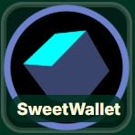

# SweetWallet



SweetWallet is a mobile-first Sugarchain web wallet focused on wallet-only behavior.

## Features

- Create a Sugarchain wallet in the browser
- Open a wallet from a Sugarchain WIF private key
- Show live SUGAR balance from public APIs
- Display receive address and QR code
- Send SUGAR with client-side transaction signing and explicit confirmation
- Broadcast raw transaction hex
- View and copy address, public key, private key WIF, and SegWit redeem script
- Switch Sugarchain API backend
- Open address and transaction history in the Sugarchain explorer
- Logout without storing private key material
- Optional starter funding for newly created zero-balance wallets when the local server has a funding wallet configured

## Run

```powershell
npm start
```

Open:

`http://localhost:8080/#/`

## Cloudflare Deploy

This repo includes `wrangler.jsonc` and `.assetsignore` so `npx wrangler deploy` uploads only the browser wallet assets, not `node_modules` or local development files.

## Safety

SweetWallet does not fake balances, does not auto-broadcast user spend transactions, and does not send private keys or WIFs to a server. Back up the WIF shown in the Keys panel before closing a newly created wallet.

## Starter Funding

New wallets can request optional starter funding of `0.025 SUGAR`. To enable it locally, set these in `.env`:

```powershell
SWEETWALLET_FUNDING_ADDRESS=sugar1q39n666w687nxm9x98tx5kgw2uvk780gtmd6yyu
SWEETWALLET_FUNDING_WIF=your-funding-wallet-wif
SWEETWALLET_STARTER_FUNDING_ENABLED=true
```

Only the new wallet address is sent to the local server. The newly generated private key stays in the browser view.
